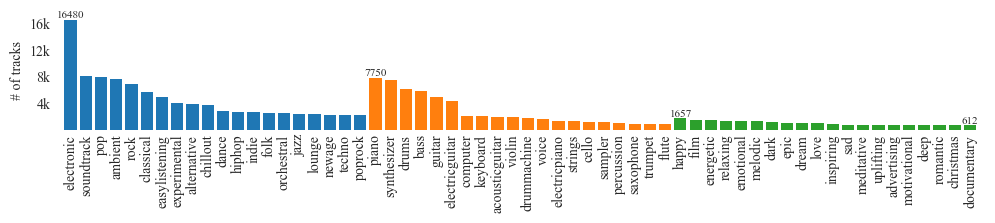

# 🎧 Jamendo 多模型音乐标签预测工具

本项目整合了多个基于 [Jamendo Dataset](https://mtg.github.io/jamendo-tagging/) 的音乐标签预测模型（如 CRNN、FCN、Musicnn、Attention 等），可快速对音频进行标签打标、模型评估与对比分析。

## 📁 项目结构


## ⚙️ 使用方法

### 1. 准备音频

将 `.wav` 文件放入 `my_music/` 目录中（或其他你指定的路径）。
不要放 mp3，可能不支持，需要先使用 ffmpeg 来转换一下，没有测试。
### 2. 执行批量预测

```bash
python batch_predict_csv.py \
    --input_dir my_music \
    --output_dir results \
    --model_dir models/jamendo \
    --top_k 5


python batch_predict_csv.py --dataset jamendo --model sample --audio_folder my_music
python batch_predict_csv.py --dataset jamendo --model se --audio_folder my_music


参数说明：
	•	--input_dir：音频文件所在目录
	•	--output_dir：预测结果输出目录（自动生成多个模型的结果）
	•	--model_dir：模型文件目录，应包含子目录 crnn/, fcn/, musicnn/ 等，每个子目录下有 best_model.pth
	•	--top_k：每个音频输出前 K 个标签（默认 5）

⸻

🧪 示例输出

执行后会在 results/ 目录生成如下文件：

results_jamendo_crnn_YYYYMMDD.json
results_jamendo_fcn_YYYYMMDD.json
...

每个文件是该模型对所有音频的标签预测结果（Top-K 标签 + 置信度）。


python run_all_models.py --dataset jamendo --audio_folder my_music
	•	脚本会在执行前先查找 results_jamendo_<model>_20250419.csv（日期自动取当天）。
	•	若文件已存在，则打印 ⏩ <model> 已有今日结果，跳过 并继续下一个模型。
	•	若不存在，就调用 batch_predict_csv.py 正常跑模型并生成结果。


⸻

✅ 支持的模型

模型名称	描述
crnn	基于卷积 + RNN 的模型
fcn	全卷积网络
musicnn	基于 Musicnn 特征
hcnn	深度卷积网络
attention	带注意力机制的模型
se	squeeze-excitation 机制模型
short_res	轻量化 ResNet
sample	测试模型
…	

所有模型可在 models/jamendo/<model_name>/best_model.pth 下找到。

⸻

📊 后续分析建议
	•	Jaccard 相似度分析：比较不同模型 Top-K 标签预测的一致性
	•	标签分布可视化：标签词云、频率柱状图
	•	预测置信度统计：平均概率分布
	•	标签对比分析：跨模型标签一致率对比表格或热图

推荐使用 Jupyter 或 Python 脚本进行定制化分析。

⸻

🧩 依赖安装

pip install torch torchaudio librosa pandas

我是在 Python3.11.9下面成功的：
pip list
Package                  Version
------------------------ -----------
audioread                3.0.1
beautifulsoup4           4.13.4
certifi                  2025.1.31
cffi                     1.17.1
charset-normalizer       3.4.1
cycler                   0.12.1
decorator                5.2.1
filelock                 3.18.0
fonttools                4.57.0
fsspec                   2025.3.2
gdown                    4.2.1
idna                     3.10
Jinja2                   3.1.6
joblib                   1.4.2
kiwisolver               1.4.8
lazy_loader              0.4
librosa                  0.11.0
llvmlite                 0.44.0
MarkupSafe               3.0.2
matplotlib               3.5.1
mpmath                   1.3.0
msgpack                  1.1.0
networkx                 3.4.2
numba                    0.61.2
numpy                    1.26.4
nvidia-cublas-cu12       12.4.5.8
nvidia-cuda-cupti-cu12   12.4.127
nvidia-cuda-nvrtc-cu12   12.4.127
nvidia-cuda-runtime-cu12 12.4.127
nvidia-cudnn-cu12        9.1.0.70
nvidia-cufft-cu12        11.2.1.3
nvidia-curand-cu12       10.3.5.147
nvidia-cusolver-cu12     11.6.1.9
nvidia-cusparse-cu12     12.3.1.170
nvidia-cusparselt-cu12   0.6.2
nvidia-nccl-cu12         2.21.5
nvidia-nvjitlink-cu12    12.4.127
nvidia-nvtx-cu12         12.4.127
packaging                24.2
pandas                   1.5.3
pillow                   11.2.1
pip                      25.0.1
platformdirs             4.3.7
pooch                    1.8.2
pycparser                2.22
pyparsing                3.2.3
PySocks                  1.7.1
python-dateutil          2.9.0.post0
pytz                     2025.2
requests                 2.32.0
scikit-learn             1.3.2
scipy                    1.10.0
setuptools               65.5.0
six                      1.17.0
soundfile                0.13.1
soupsieve                2.6
soxr                     0.5.0.post1
sympy                    1.13.1
tabulate                 0.9.0
threadpoolctl            3.6.0
torch                    2.6.0
torchaudio               2.6.0
torchlibrosa             0.1.0
tqdm                     4.62.3
triton                   3.2.0
typing_extensions        4.13.2
urllib3                  1.26.19


⸻

📌 许可协议

MIT License

---

# The MTG-Jamendo Dataset

[](https://doi.org/10.5281/zenodo.3826813)

We present the MTG-Jamendo Dataset, a new open dataset for music auto-tagging. It is built using music available at Jamendo under Creative Commons licenses and tags provided by content uploaders. The dataset contains over 55,000 full audio tracks with 195 tags from genre, instrument, and mood/theme categories. We provide elaborated data splits for researchers and report the performance of a simple baseline approach on five different sets of tags: genre, instrument, mood/theme, top-50, and overall.

This repository contains metadata, scripts, instructions on how to download and use the dataset and reproduce baseline results.

A subset of the dataset was used in the [Emotion and Theme Recognition in Music Task](https://multimediaeval.github.io/2021-Emotion-and-Theme-Recognition-in-Music-Task/) within [MediaEval 2019-2021](https://multimediaeval.github.io/).

<!-- TOC start (generated with https://github.com/derlin/bitdowntoc) -->
Table of contents:
* [Structure](#structure)
    + [Metadata files in `data`](#metadata-files-in-data)
    + [Statistics in `stats`](#statistics-in-stats)
+ [Using the dataset](#using-the-dataset)
    + [Requirements](#requirements)
    + [Downloading the data](#downloading-the-data)
    + [Loading data in python](#loading-data-in-python)
    + [Reproduce postprocessing & statistics](#reproduce-postprocessing--statistics)
    + [Recreate subsets](#recreate-subsets)
    + [Reproduce experiments](#reproduce-experiments)
* [Related Datasets](#related-datasets)
    + [Music Classification Annotations](#music-classification-annotations)
    + [Song Describer](#song-describer)
* [Research challenges using the dataset](#research-challenges-using-the-dataset)
* [Citing the dataset](#citing-the-dataset)
* [License](#license)
* [Acknowledgments](#acknowledgments)
<!-- TOC end -->


## Structure

### Metadata files in [`data`](https://github.com/MTG/mtg-jamendo-dataset/tree/master/data)

Pre-processing
- `raw.tsv` (56,639) - raw file without postprocessing
- `raw_30s.tsv`(55,701) - tracks with duration more than 30s
- `raw_30s_cleantags.tsv`(55,701) - with tags merged according to `tag_map.json`
- `raw_30s_cleantags_50artists.tsv`(55,609) - with tags that have at least 50 unique artists
- `tag_map.json` - map of tags that we merged
- `tags_top50.txt` - list of top 50 tags
- `autotagging.tsv` = `raw_30sec_cleantags_50artists.tsv` - base file for autotagging (after all postprocessing, 195 tags)

Subsets
- `autotagging_top50tags.tsv` (54,380) - only top 50 tags according to tag frequency in terms of tracks
- `autotagging_genre.tsv` (55,215) - only tracks with genre tags (95 tags), and only those tags
- `autotagging_instrument.tsv` (25,135) - instrument tags (41 tags)
- `autotagging_moodtheme.tsv` (18,486) - mood/theme tags (59 tags)

Splits
- `splits` folder contains training/validation/testing sets for `autotagging.tsv` and subsets

Note: A few tags are discarded in the splits to guarantee the same list of tags across all splits. For `autotagging.tsv`, this results in **55,525 tracks** annotated by **87 genre tags, 40 instrument tags, and 56 mood/theme tags** available in the splits.

Splits are generated from `autotagging.tsv`, containing all tags. For each split, the related subsets (top50, genre, instrument, mood/theme) are built filtering out unrelated tags and tracks without any tags.

Some additional metadata from Jamendo (artist, album name, track title, release date, track URL) is available in `raw.meta.tsv` (56,693).

### Statistics in [`stats`](https://github.com/MTG/mtg-jamendo-dataset/tree/master/stats)



Statistics of number of tracks, albums and artists per tag sorted by number of artists.
Each directory has statistics for metadata file with the same name.
[Here](stats/raw_30s_cleantags_50artists) is the statistics for the `autotagging` set.
Statistics for subsets based on categories are not kept seperated due to it already included in `autotagging`.

## Using the dataset

### Requirements

* Python 3.7+
* Download dataset repository
```bash
git clone https://github.com/MTG/mtg-jamendo-dataset.git
cd mtg-jamendo-dataset
```
* Create virtual environment and install requirements
```bash
python3 -m venv venv
source venv/bin/activate
pip install -r scripts/requirements.txt
```

The original requirements are kept in [`reguirements-orig.txt`](scripts/requirements-orig.txt)

### Downloading the data

All audio is distributed in 320kbps MP3 format. We recommend using this version of audio by default. For smaller download sizes, we also provide a lower-bitrate mono version of the same audio (converted from the full quality version to mono LAME VBR 2 `lame -V 2`). In addition we provide precomputed mel-spectrograms which are distributed as NumPy Arrays in NPY format (see computation parameters [in the code](https://github.com/MTG/mtg-jamendo-dataset/blob/master/scripts/melspectrograms.py)). We also provide precomputed statistical features from [Essentia](https://essentia.upf.edu) (used in the [AcousticBrainz](https://acousticbrainz.org) music database) in JSON format. The audio files and the NPY/JSON files are split into folders packed into TAR archives.

We provide the following data subsets:
- `raw_30s/audio` - all available audio for `raw_30s.tsv` in full quality (508 GB)
- `raw_30s/audio-low` - all available audio for `raw_30s.tsv` in low quality (156 GB)
- `raw_30s/melspecs` - mel-spectrograms for `raw_30s.tsv` (229 GB)
- `autotagging-moodtheme/audio` - audio for the mood/theme subset `autotagging_moodtheme.tsv` in full quality (152 GB)
- `autotagging-moodtheme/audio-low` - audio for the mood/theme subset `autotagging_moodtheme.tsv` in low quality (46 GB)
- `autotagging-moodtheme/melspecs` - mel-spectrograms for the `autotagging_moodtheme.tsv` subset (68 GB)

We provide a script to download and validate all files in the dataset. See its help message for more information:

```bash
python3 scripts/download/download.py -h
```
```
usage: download.py [-h] [--dataset {raw_30s,autotagging_moodtheme}]
                   [--type {audio,audio-low,melspecs,acousticbrainz}]
                   [--from {mtg,mtg-fast}] [--unpack] [--remove]
                   outputdir

Download the MTG-Jamendo dataset

positional arguments:
  outputdir             directory to store the dataset

options:
  -h, --help            show this help message and exit
  --dataset {raw_30s,autotagging_moodtheme}
                        dataset to download (default: raw_30s)
  --type {audio,audio-low,melspecs,acousticbrainz}
                        type of data to download (audio, audio in low quality,
                        mel-spectrograms, AcousticBrainz features) (default: audio)
  --from {mtg,mtg-fast}
                        download from MTG (server in Spain, slow),
                        or fast MTG mirror (Finland) (default: mtg-fast)
  --unpack              unpack tar archives (default: False)
  --remove              remove tar archives while unpacking one by one (use to
                        save disk space) (default: False)

```

For example, to download audio for the `autotagging_moodtheme.tsv` subset, unpack and validate all tar archives:

```
mkdir /path/to/download
python3 scripts/download/download.py --dataset autotagging_moodtheme --type audio /path/to/download --unpack --remove
```


Unpacking process is run after tar archive downloads are complete and validated. In the case of download errors, re-run the script to download missing files.

Due to the large size of the dataset, it can be useful to include the `--remove` flag to save disk space: in this case, tar archive are unpacked and immediately removed one by one.


### Loading data in python
Assuming you are working in `scripts` folder
```python
import commons

input_file = '../data/autotagging.tsv'
tracks, tags, extra = commons.read_file(input_file)
```

`tracks` is a dictionary with `track_id` as key and track data as value:
```python
{
    1376256: {
    'artist_id': 490499,
    'album_id': 161779,
    'path': '56/1376256.mp3',
    'duration': 166.0,
    'tags': [
        'genre---easylistening',
        'genre---downtempo',
        'genre---chillout',
        'mood/theme---commercial',
        'mood/theme---corporate',
        'instrument---piano'
        ],
    'genre': {'chillout', 'downtempo', 'easylistening'},
    'mood/theme': {'commercial', 'corporate'},
    'instrument': {'piano'}
    }
    ...
}
```
`tags` contains mapping of tags to `track_id`:
```python
{
    'genre': {
        'easylistening': {1376256, 1376257, ...},
        'downtempo': {1376256, 1376257, ...},
        ...
    },
    'mood/theme': {...},
    'instrument': {...}
}
```
`extra` has information that is useful to format output file, so pass it to `write_file` if you are using it, otherwise you can just ignore it

### Reproduce postprocessing & statistics

* Recompute statistics for `raw` and `raw_30s`
```bash
python3 scripts/get_statistics.py data/raw.tsv stats/raw
python3 scripts/get_statistics.py data/raw_30s.tsv stats/raw_30s
```

* Clean tags and recompute statistics (`raw_30s_cleantags`)
```bash
python3 scripts/clean_tags.py data/raw_30s.tsv data/tag_map.json data/raw_30s_cleantags.tsv
python3 scripts/get_statistics.py data/raw_30s_cleantags.tsv stats/raw_30s_cleantags
```

* Filter out tags with low number of unique artists and recompute statistics (`raw_30s_cleantags_50artists`)
```bash
python3 scripts/filter_fewartists.py data/raw_30s_cleantags.tsv 50 data/raw_30s_cleantags_50artists.tsv --stats-directory stats/raw_30s_cleantags_50artists
```

* `autotagging` file in `data` and folder in `stats` is a symbolic link to `raw_30s_cleantags_50artists`

* Visualize top 20 tags per category
```bash
python3 scripts/visualize_tags.py stats/autotagging 20  # generates top20.pdf figure
```

### Recreate subsets
* Create subset with only top50 tags by number of tracks
```bash
python3 scripts/filter_toptags.py data/autotagging.tsv 50 data/autotagging_top50tags.tsv --stats-directory stats/autotagging_top50tags --tag-list data/tags/tags_top50.txt
python3 scripts/split_filter_subset.py data/splits autotagging autotagging_top50tags --subset-file data/tags/top50.txt
```

* Create subset with only mood/theme tags (or other category: genre, instrument)
```bash
python3 scripts/filter_category.py data/autotagging.tsv mood/theme data/autotagging_moodtheme.tsv --tag-list data/tags/moodtheme.txt
python3 scripts/split_filter_subset.py data/splits autotagging autotagging_moodtheme --category mood/theme
```

### Reproduce experiments
* Preprocessing
```bash
python3 scripts/baseline/get_npy.py run 'your_path_to_spectrogram_npy'
```

* Train
```bash
python3 scripts/baseline/main.py --mode 'TRAIN'
```
* Test
```bash
python3 scripts/baseline/main.py --mode 'TEST'
```
```
optional arguments:
  --batch_size                batch size (default: 32)
  --mode {'TRAIN', 'TEST'}    train or test (default: 'TRAIN')
  --model_save_path           path to save trained models (default: './models')
  --audio_path                path of the dataset (default='/home')
  --split {0, 1, 2, 3, 4}     split of data to use (default=0)
  --subset {'all', 'genre', 'instrument', 'moodtheme', 'top50tags'}
                              subset to use (default='all')
```

#### Results

* [ML4MD2019](results/ml4md2019): 5 splits, 5 tag sets (3 categories, top50, all)
* [Mediaeval2019](results/mediaeval2019): split-0, mood/theme category

## Related Datasets
The MTG-Jamendo Dataset can be linked to related datasets tailored to specific applications.


### Music Classification Annotations
The [Music Classification Annotations](derived/music-classification-annotations/README.md) contains annotations for the [split-0 test set](data/splits/split-0/autotagging-test.tsv) according to the taxonomies of 15 existing music classification datasets including genres, moods, danceability, voice/instrumental, gender, and tonal/atonal.
These labels are suitable for training individual classifiers or learning everything in a multi-label setup (auto-tagging).
Most of the taxonomies were annotated by three different annotators.
We provide the subset of annotations with perfect inter-annotator agreement ranging from 411 to 8756 tracks depending on the taxonomy.


### Song Describer
[Song Describer Dataset](https://zenodo.org/records/10072001) contains ~1.1k captions for 706 permissively licensed music recordings. It is designed for use in evaluation of models that address music-and-language tasks such as music captioning, text-to-music generation and music-language retrieval. The dataset was built using the [Song Describer](https://song-describer.streamlit.app/) platform for crowdsourcing music captions (audio-text pairs) for audio tracks in MTG-Jamendo.


## Research challenges using the dataset

- [MediaEval 2019 Emotion and Theme Recognition in Music](https://multimediaeval.github.io/2019-Emotion-and-Theme-Recognition-in-Music-Task/)
- [MediaEval 2020 Emotion and Theme Recognition in Music](https://multimediaeval.github.io/2020-Emotion-and-Theme-Recognition-in-Music-Task/)
- [MediaEval 2021 Emotion and Theme Recognition in Music](https://multimediaeval.github.io/2021-Emotion-and-Theme-Recognition-in-Music-Task/)


## Citing the dataset

Please consider citing [the following publication](https://repositori.upf.edu/handle/10230/42015) when using the dataset:

> Bogdanov, D., Won M., Tovstogan P., Porter A., & Serra X. (2019). The MTG-Jamendo Dataset for Automatic Music Tagging. Machine Learning for Music Discovery Workshop, International Conference on Machine Learning (ICML 2019).

```
@conference {bogdanov2019mtg,
    author = "Bogdanov, Dmitry and Won, Minz and Tovstogan, Philip and Porter, Alastair and Serra, Xavier",
    title = "The MTG-Jamendo Dataset for Automatic Music Tagging",
    booktitle = "Machine Learning for Music Discovery Workshop, International Conference on Machine Learning (ICML 2019)",
    year = "2019",
    address = "Long Beach, CA, United States",
    url = "http://hdl.handle.net/10230/42015"
}
```

## License

* The code in this repository is licensed under [Apache 2.0](LICENSE) 
* The metadata is licensed under a [CC BY-NC-SA 4.0](https://creativecommons.org/licenses/by-nc-sa/4.0/).
* The audio files are licensed under Creative Commons licenses, see individual licenses for details in `audio_licenses.txt`.

Copyright 2019-2023 Music Technology Group

## Acknowledgments

This work was funded by the predoctoral grant MDM-2015-0502-17-2 from the Spanish Ministry of Economy and Competitiveness linked to the Maria de Maeztu Units of Excellence Programme (MDM-2015-0502). 

This project has received funding from the European Union's Horizon 2020 research and innovation programme under the Marie Skłodowska-Curie grant agreement No. 765068.

This work has received funding from the European Union's Horizon 2020 research and innovation programme under grant agreement No 688382 "AudioCommons".


